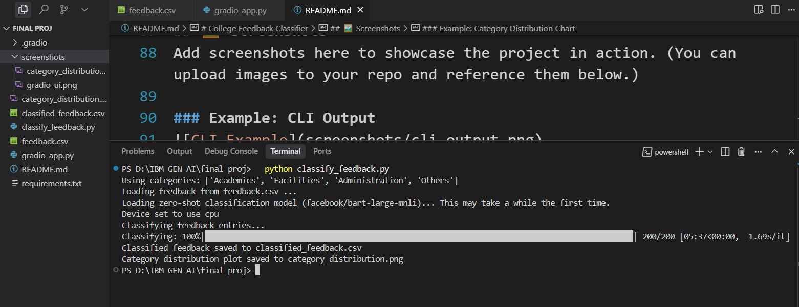
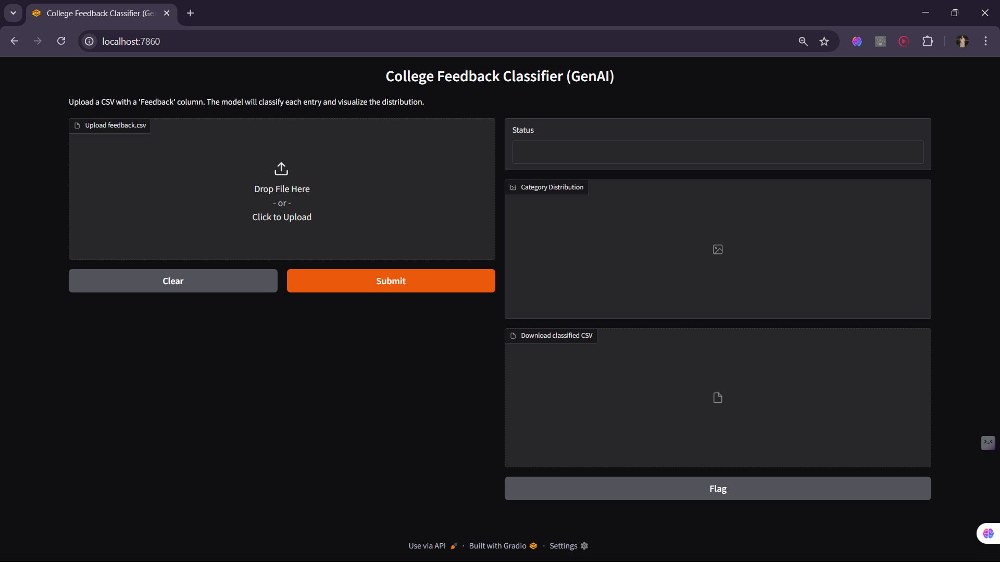
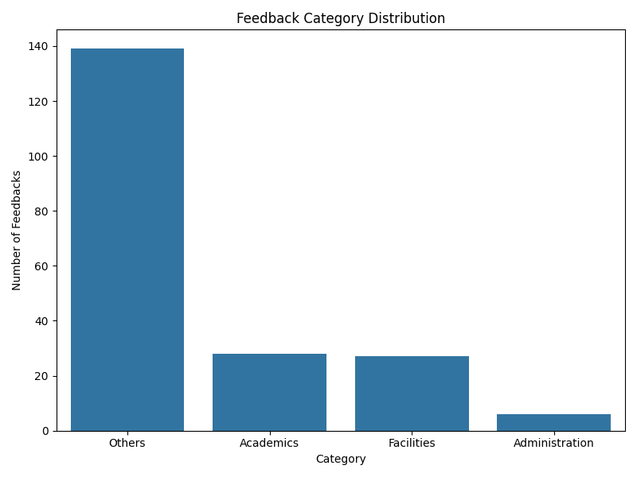

# College Feedback Classifier


A modern, user-friendly tool to automatically classify college feedback into meaningful categories using state-of-the-art NLP (zero-shot classification with Hugging Face Transformers). Analyze, visualize, and export categorized feedback with ease!

---

## 🚀 Project Overview
This project helps colleges and institutions quickly analyze student feedback by classifying each entry into categories such as **Academics**, **Facilities**, **Administration**, and **Others**. It supports both command-line and web (Gradio) interfaces, and provides visual insights with easy-to-understand charts.

---

## ✨ Features
- **Zero-shot classification** using `facebook/bart-large-mnli` (no manual model training required)
- **Flexible categories**: Use default or custom categories
- **CSV input/output**: Reads feedback from CSV, writes results to a new CSV
- **Visual analytics**: Generates a bar chart of feedback distribution
- **Gradio web app**: Upload CSV, get instant results and download outputs
- **Robust error handling** and user-friendly messages

---

## 📂 Project Structure
```
├── classify_feedback.py      # Command-line tool for batch classification
├── gradio_app.py            # Gradio web interface
├── requirements.txt         # Python dependencies
├── feedback.csv             # Example input file
├── README.md                # Project documentation
└── ...
```

---

## 🛠️ Setup Instructions
1. **Clone the repository:**
   ```bash
   git clone https://github.com/lankasreenaina/College-feedback-classifier.git
   cd College-feedback-classifier
   ```
2. **Install dependencies:**
   ```bash
   pip install -r requirements.txt
   ```
3. **Prepare your feedback file:**
   - Ensure your CSV has a column named `Feedback`.
   - You can use the provided `feedback.csv` as a template.

---

## ⚡ Usage

### 1. Command-Line Interface
Classify feedback and generate outputs directly from the terminal.

```bash
python classify_feedback.py
```

**Options:**
- Use custom categories:
  ```bash
  python classify_feedback.py --categories "Academics,Facilities,Administration,Others,Hostel"
  ```
- Specify input/output files:
  ```bash
  python classify_feedback.py --input my_feedback.csv --output results.csv --plot my_plot.png
  ```

**Outputs:**
- `classified_feedback.csv`: CSV with predicted categories
- `category_distribution.png`: Bar chart of feedback counts per category

### 2. Gradio Web App
A simple web interface for non-technical users.

```bash
python gradio_app.py
```
- Open the provided local URL in your browser (e.g., http://127.0.0.1:7860)
- Upload your `feedback.csv`
- View/download the results and chart instantly

---

## 🖼️ Screenshots
Add screenshots here to showcase the project in action. (You can upload images to your repo and reference them below.)

### Example: CLI Output

*Sample output after running the command-line tool.*

### Example: Gradio Web App

*The Gradio web interface for uploading and classifying feedback.*

### Example: Category Distribution Chart

*Bar chart showing the distribution of feedback categories.*

> **Tip:** To add your own screenshots, create a `screenshots/` folder and upload images. Update the image links above accordingly.

---

## 🧩 How It Works
- Uses Hugging Face's `facebook/bart-large-mnli` model for zero-shot text classification
- Reads each feedback entry and predicts the most likely category
- Outputs results to CSV and generates a bar chart for quick insights

---

## 🤝 Contributing
Contributions are welcome! Please open issues or submit pull requests for improvements, bug fixes, or new features.

---

## 📄 License
This project is licensed under the MIT License. See [LICENSE](LICENSE) for details.

---

## 🙋‍♂️ Questions?
Open an issue or contact the maintainer via GitHub.
